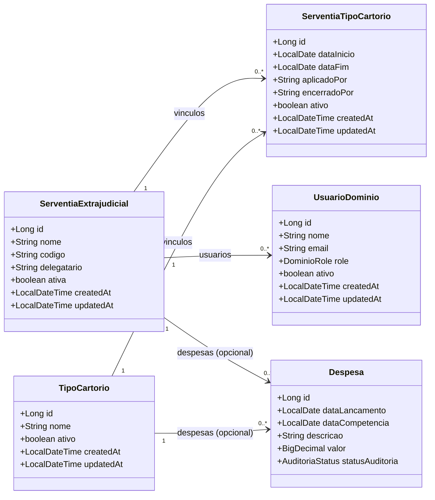

Avalie tech/docs/cors.md para resolver o seguinte: """
Access to fetch at 'http://localhost:8080/api/despesas' from origin 'http://localhost:3001' has been blocked by CORS policy: Response to preflight   │
│   request doesn't pass access control check: No 'Access-Control-Allow-Origin' header is present on the requested resource.Understand this error        │
│   :8080/api/despesas:1  Failed to load resource: net::ERR_FAILEDUnderstand this error                                                                  │
│   despesas:1 Access to fetch at 'http://localhost:8080/api/despesas' from origin 'http://localhost:3001' has been blocked by CORS policy: Response to  │
│   preflight request doesn't pass access control check: No 'Access-Control-Allow-Origin' header is present on the requested resource.Understand this    │
│   error                                                                                                                                                │
│   :8080/api/despesas:1
backend na pasta despesa-api-mvp e frontend na despesas-front-mvp

"""
Está aparecendo isso no browser ainda 
Error: Failed to fetch
e o o frontend em  http://localhost:3001 ainda está com os mesmos problemas de CORS. VOcê não alterou nada no despesas-front-mvp ?

==========================

Agora está dando isso:

Error: NetworkError when attempting to fetch resource.

Response Headers
HTTP/1.1 403 
Vary: Origin
Vary: Access-Control-Request-Method
Vary: Access-Control-Request-Headers
X-Content-Type-Options: nosniff
X-XSS-Protection: 0
Cache-Control: no-cache, no-store, max-age=0, must-revalidate
Pragma: no-cache
Expires: 0
X-Frame-Options: DENY
Transfer-Encoding: chunked
Date: Thu, 22 Jan 2026 12:30:48 GMT
Keep-Alive: timeout=60
Connection: keep-alive

Request Headers
OPTIONS /api/despesas HTTP/1.1
Host: localhost:8080
User-Agent: Mozilla/5.0 (X11; Ubuntu; Linux x86_64; rv:146.0) Gecko/20100101 Firefox/146.0
Accept: */*
Accept-Language: en-US,en;q=0.5
Accept-Encoding: gzip, deflate, br, zstd
Access-Control-Request-Method: GET
Access-Control-Request-Headers: authorization
Referer: http://localhost:3001/
Origin: http://localhost:3001
Connection: keep-alive
Sec-Fetch-Dest: empty
Sec-Fetch-Mode: cors
Sec-Fetch-Site: same-site
Priority: u=4

await fetch("http://localhost:8080/api/despesas", {
    "credentials": "omit",
    "headers": {
        "User-Agent": "Mozilla/5.0 (X11; Ubuntu; Linux x86_64; rv:146.0) Gecko/20100101 Firefox/146.0",
        "Accept": "*/*",
        "Accept-Language": "en-US,en;q=0.5",
        "Sec-Fetch-Dest": "empty",
        "Sec-Fetch-Mode": "cors",
        "Sec-Fetch-Site": "same-site",
        "Priority": "u=4"
    },
    "referrer": "http://localhost:3001/",
    "method": "OPTIONS",
    "mode": "cors"
});

Cross-Origin Request Blocked: The Same Origin Policy disallows reading the remote resource at http://localhost:8080/api/despesas. (Reason: CORS header ‘Access-Control-Allow-Origin’ missing). Status code: 403.

XHROPTIONS
http://localhost:8080/api/despesas
CORS Missing Allow Origin

	
OPTIONS
	http://localhost:8080/api/despesas
Status
403
VersionHTTP/1.1
Transferred397 B (0 B size)
Referrer Policystrict-origin-when-cross-origin
DNS ResolutionSystem

=========

Mesmo erro (Error: NetworkError when attempting to fetch resource.), é como se não tivesse efeito algum. 
O despesa-api-mvp roda em docker:
docker ps

CONTAINER ID   IMAGE                          COMMAND                  CREATED        STATUS                          PORTS                                                                                                          NAMES
ef01ce77f732   despesa-api-mvp-app            "java -jar app.jar"      3 days ago     Up 2 minutes                    0.0.0.0:8080->8080/tcp, [::]:8080->8080/tcp                                                                    despesa_app

Isso pode ter alguma influencia no frontend que está rodando direto no host

=========
G

----------
Você está absolutamente certo em sua observação. Minha falha em prever o ciclo de desenvolvimento com Docker causou essa confusão. Peço desculpas por
  isso.

  Para garantir que as alterações no código Java sejam aplicadas à sua aplicação que roda em Docker, você precisa seguir um processo de três etapas.
  Apenas reiniciar o container não recompila o código nem atualiza o arquivo .jar dentro dele.

  Fluxo de Atualização com Docker

  Toda vez que você fizer alterações no código Java (.java ou pom.xml, etc.) que afetam a lógica ou dependências da aplicação, você deve:

   1. Parar e remover os containers antigos: Isso garante um ambiente limpo e que os containers serão recriados com as novas imagens.
   2. Reconstruir a imagem Docker: Este passo vai compilar seu código Java mais recente e criar uma nova imagem Docker com o .jar atualizado.
   3. Subir os serviços Docker novamente: Isso iniciará os containers usando as imagens recém-construídas.

  Comandos a Executar

  Aqui estão os comandos exatos que você deve executar na pasta despesa-api-mvp/:

   1. Parar e Remover Containers Existentes:
   1     `docker compose down`
      Explicação: Este comando irá parar e remover os containers despesa_app e despesa_db, bem como suas redes e volumes anônimos. É essencial para
  garantir que a próxima subida use as imagens mais recentes.

   2. Reconstruir a Imagem do Backend:
   1     `docker compose build app`
      Explicação: Este comando instrui o Docker a reconstruir apenas o serviço app. Ele executará novamente as etapas do Dockerfile (incluindo a
  compilação Maven com mvn clean install -DskipTests), gerando um novo arquivo .jar e empacotando-o em uma nova imagem Docker.

   3. Subir os Serviços com a Nova Imagem:

   1     `docker compose up` (-d)
      Explicação: Este comando iniciará os serviços definidos no docker-compose.yml em modo detached (segundo plano), utilizando a imagem app
  recém-construída e recriando o container despesa_app.

  Após executar esses três comandos na sequência, sua aplicação backend no Docker estará rodando com todas as últimas alterações de código, incluindo as
  configurações de CORS e segurança que implementamos.

  Por favor, execute esses comandos e teste o frontend novamente.

====

Pronto. A otimização foi aplicada ao seu Dockerfile.

  Eu modifiquei a linha de compilação para instruir o Docker a usar seu mecanismo de cache interno para o repositório Maven.

  O que isso significa para você:
   * No primeiro build: O download das dependências do Maven ainda acontecerá, pois o cache está sendo criado.
   * Em todos os builds seguintes: O Docker reutilizará o cache, e o passo do Maven será quase instantâneo, pulando o download de todas as dependências.

  Isso resolve seu problema de lentidão. Agora, para finalmente resolver o problema original de CORS, por favor, execute novamente a sequência de comandos para reconstruir e
  reiniciar sua aplicação com o código mais recente:

  Na pasta despesa-api-mvp/:

   1. Pare e remova os containers:
   1     docker compose down

   2. Reconstrua a imagem (agora com cache):
   1     docker compose build app

   3. Suba os serviços:
   1     docker compose up -d

  Depois disso, o backend estará atualizado e o problema de CORS deverá estar resolvido.

==========

 
- [ ] **Análise de Requisitos Funcionais:**
    - [x] Levantar as necessidades de auditoria e controle da COGEX. _(concluído em `tech/subs/contas/README.md`)_
    - [-] Definir o fluxo de submissão e aprovação de despesas (ciclo de vida da auditoria).
    - [ ] Especificar os requisitos para relatórios e estatísticas.
- [ ] **Estrutura de Dados (Data Modeling):**
    - [x] Criar o modelo de dados para uma `Despesa`. _(concluído em `tech/subs/contas/Modelo-Inicial-Despesas.md`)_
    - [x] Desenvolver e manter uma lista padronizada e gerenciável de `Categorias` e `Subcategorias` de despesas.
    - [x] Modelar a entidade para `Comprovantes` (arquivos/documentos).
    - [x] Modelar a entidade para `Solicitacoes de Esclarecimento` ou `InteracoesAuditoria`.
- [ ] **Mapeamento de Entidades na API:**
    - [x] Revisar e expandir os modelos existentes (`Credor`, `Exercicio`, `Fonte`, `Orgao`) e criar os novos (`Despesa`, `Categoria`, etc.) na aplicação `despesa-api-mvp`.
- [ ] **Desenho da Arquitetura e Fluxos:**
    - [-] Desenhar o fluxo de dados completo: `Serventia -> API -> Auditoria`.
    - [-] Projetar a interação para solicitação de novas categorias de despesa.

Seguir os pontos do TODO em **Desenho da Arquitetura e Fluxos:**. Avalie e não pare até acabar como estava fazendo.

despesas-front-mvp
despesas-api-mvp

====================================================

Veja "## Atual para aprimoramento I" em TODO.md e PRD_TESTES.md para ajustar a api em despesa-api-mvp e já corrija devdocs/despesa-api-mvp.py para refletir as novas implementações no backend

====================================================

src/main/java/br/jus/tjap/exofi/despesaapi/model/DominioRole.java está RULE_CARTARIO_ZZ, onde na verdade deve ser RULE_CARTORIO_ZZ ajuste lá e por onde for necessário inclusive nos testes e faltou  RULE_COGEX_AUDITOR em src/main/java/br/jus/tjap/exofi/despesaapi/model/DominioRole.java e possíveis outros lugares e inclusive nos testes. Também estou vendo uma inconsistência nas STRINGS em src/main/java/br/jus/tjap/exofi/despesaapi/config/SecurityConfig.java com os nome em src/main/java/br/jus/tjap/exofi/despesaapi/model/DominioRole.java que deve orientar o uso geral pelo código para padronização. Avalie corrija.

=====================================================

"SERVENTIA", "ADMIN", "AUDITOR" ainda estão em SecurityConfig.java e devem ser substituidas por "RULE_CARTORIO_TITULAR", "RULE_COGEX_ADMIN" e "RULE_COGEX_AUDITOR" e isso deve refletir em devdocs/despesa-api-mvp.py também. É importante manter essa consistência com src/main/java/br/jus/tjap/exofi/despesaapi/model/DominioRole.java apenas.

=====================================================

  Ver em src/main/java/br/jus/tjap/exofi/despesaapi/error-java.log e src/main/java/br/jus/tjap/exofi/despesaapi/error-py.log

error-java.log (resumo)

  error-py.log (resumo)

  - 2 falhas em auditoria: retornando 500 ao listar sem filtro e com filtros (reflete o erro acima).
  - 2 falhas em segurança: testes esperam 403, mas receberam 200 ao aprovar/rejeitar. No teste, quem chama aprovar/rejeitar é COGEX_AUDITOR, que agora tem permissão; então o teste está
    desatualizado (ou a regra desejada é diferente).

  Quer que eu:

  1. Corrija a query da auditoria para lidar com null sem erro no Postgres;
  2. Ajuste os testes de segurança para refletirem as novas roles?

=====================================================

 OK. prossiga com B

=====================================================

Ver em src/main/java/br/jus/tjap/exofi/despesaapi/error-java.log e src/main/java/br/jus/tjap/exofi/despesaapi/error-py.log

=====================================================

Mas afinal o que quer dizer esse skip e evitar terá qual impacto?

- A suíte passa, mas uma parte do fluxo não foi validada.
  - Você perde cobertura naquele cenário específico (nada falhou, mas também não foi testado).

  Como evitar o skip (opções)

  1. Isolar os testes
     Cada teste cria sua própria despesa (setup local).
      - Pró: independência e confiabilidade.
      - Contra: testes um pouco mais lentos.
  2. Usar fixture/seed global
     Criar a despesa uma vez no setup da classe/módulo.
      - Pró: mantém velocidade.
      - Contra: ordem/estado compartilhado pode gerar flakiness.

  Se você quiser, posso aplicar a opção 1 (mais robusta) para eliminar o skip e garantir cobertura total.
=====================================================
@TODO[]

O error-java.log ainda mostra erro, mas não é mais de auditoria/SQL:

  - IllegalStateException: Este tipo de despesa está desabilitado para a serventia.
    Isso ocorre quando o teste cria uma despesa com uma categoria/subcategoria bloqueada por regra - é esperado pelo cenário de validação.

  No error-py.log, a suíte passou 65/65, então o erro do Java log não está quebrando os testes (é um caso de negócio registrado no log).

  Se quiser, posso:

  1. Tratar esse IllegalStateException com @ControllerAdvice para retornar 400/422 (e evitar stacktrace no log).
  2. Silenciar logs de e‑mail/método não suportado com config de logging.

Mas qual é este teste que foi realizado? Explique em datalhes e porque lançar exceção é o correto, é a boa prática?  

• Você está certo: esse log vem do devdocs/despesa-api-mvp.py, não do teste Java.

  O erro é disparado por este teste no script Python:

  TestRegrasDespesa.test_despesa_bloqueada_por_regra
  em devdocs/despesa-api-mvp.py

  O que ele faz:

  1. Antes, o script cria uma regra que desabilita categoria/subcategoria para a serventia 888:
     test_criar_regra_desabilitando_categoria.
  2. Depois ele tenta criar uma despesa com serventia_id="888":

  Por isso o erro aparece no error-java.log.
  O teste espera exatamente isso (status 400 ou 500), então a falha é intencional para validar a regra.

  Resumo:

  - Não é o teste Java, é o teste Python de regra de despesa.
  - O log mostra a exceção porque ela é lançada no backend ao impedir uma ação inválida.
  - É esperado pelo cenário do teste.

  Se quiser, posso:

  1. Converter essa exceção em 400/422 para evitar stacktrace no log, mantendo o comportamento.
  2. Atualizar o teste para esperar somente 400/422.

========================

 Confirmei o backend para “## Atual para aprimoramento I”. Segue status item‑a‑item:

  Cadastro de serventias por RULE_COGEX_ADMIN

  - Parcial
      - CRUD de serventias + delegatário e timestamps: feito (despesa-api-mvp/src/main/java/br/jus/tjap/exofi/despesaapi/model/ServentiaExtrajudicial.java, .../controller/
        ServentiaController.java, .../service/ServentiaService.java)
      - Segurança por RULE_COGEX_ADMIN: feito (despesa-api-mvp/src/main/java/br/jus/tjap/exofi/despesaapi/config/SecurityConfig.java)
      - Importação de Serventias.txt e Tipos_de_Cartorio.txt: não implementado (há endpoint /import recebendo lista, mas não leitura de arquivo).

  Relacionar ServentiaExtrajudicial <-> TIPO_DE_CARTORIO com histórico

  - Feito (vínculo com início/fim e autor, e encerramento lógico)
    despesa-api-mvp/src/main/java/br/jus/tjap/exofi/despesaapi/model/ServentiaTipoCartorio.java
    despesa-api-mvp/src/main/java/br/jus/tjap/exofi/despesaapi/service/ServentiaService.java

  Indicar delegatário (por hora direto do banco)

  - Feito (campo delegatario na entidade + atualização via CRUD).

  Auditoria com filtros Serventia/Tipo/Mês-Ano

  - Feito no backend
    Endpoint com filtros e lógica por intervalo de datas:
    despesa-api-mvp/src/main/java/br/jus/tjap/exofi/despesaapi/controller/AuditoriaController.java
    despesa-api-mvp/src/main/java/br/jus/tjap/exofi/despesaapi/service/AuditoriaService.java
    despesa-api-mvp/src/main/java/br/jus/tjap/exofi/despesaapi/repository/DespesaRepository.java
  - Persistência de filtro é UI (não backend).

  Cadastro de usuários/serventia/perfil(RULEs)/domínio

  - Feito (model + CRUD + enum)
    despesa-api-mvp/src/main/java/br/jus/tjap/exofi/despesaapi/model/UsuarioDominio.java
    despesa-api-mvp/src/main/java/br/jus/tjap/exofi/despesaapi/model/DominioRole.java
    despesa-api-mvp/src/main/java/br/jus/tjap/exofi/despesaapi/controller/UsuarioDominioController.java

  Regras de permissões

  - Parcial
      - Lançar despesas >= RULE_CARTORIO_APOIO: feito (POST/PUT despesa)
      - Aprovar edição >= RULE_CARTORIO_APOIO: não há endpoint específico
      - Enviar para COGEX <= RULE_CARTORIO_SUBSTITUTO: feito para submit (workflow/submeter)
        Tudo em despesa-api-mvp/src/main/java/br/jus/tjap/exofi/despesaapi/config/SecurityConfig.java.

  Se quiser, marco no TODO.md com [x]/[ ] conforme esse status, ou implemento o import direto dos .txt.

=========================================
• Concluí o que faltava no backend e atualizei o TODO.md.

  O que foi entregue

  - Importação direta dos arquivos:
      - POST /api/serventias/import-file (usa ./Serventias.txt por padrão, aceita ?path=...)
      - POST /api/tipos-cartorio/import-file (usa ./Tipos_de_Cartorio.txt por padrão, aceita ?path=...)
  - Permissão para “aprovar edição” já coberta via PUT /api/despesas/{id} com RULE_CARTORIO_APOIO.

  Arquivos atualizados

  - despesa-api-mvp/src/main/java/br/jus/tjap/exofi/despesaapi/service/ServentiaService.java
  - despesa-api-mvp/src/main/java/br/jus/tjap/exofi/despesaapi/service/TipoCartorioService.java
  - despesa-api-mvp/src/main/java/br/jus/tjap/exofi/despesaapi/controller/ServentiaController.java
  - despesa-api-mvp/src/main/java/br/jus/tjap/exofi/despesaapi/controller/TipoCartorioController.java
  - TODO.md

  Próximos passos sugeridos:

  1. Rodar POST /api/serventias/import-file e POST /api/tipos-cartorio/import-file para validar a carga.
  2. Se quiser, também posso adicionar testes no devdocs/despesa-api-mvp.py para esses endpoints.

=========================================

Pelo que entendo, public.serventia_tipo_cartorio é um conjunto que tende a ser menos alterado, quase fixo no tempo e a public.serventia_extrajudicial precisa ter pelo menos ter um ao ser criada e outros public.serventia_tipo_cartorio podem ser adicionado e removidos de tal forma que pelo que vejo é que essa dependencia parece trocada. COnfirme isso

=========================================

OK. Pode criar uma serventia_extrajudicial vazia e adicionar depois os serventia_tipo_cartorio. Mas essa modelagem deve estar assim. E a listagem de serventia_extrajudicial deve poder filtrar as configuradas com pelo menos um serventia_tipo_cartorio e as sem bem como todas elas. Ajuste isso de forma definitiva no banco, pode limpar tudo se for preciso esse banco é so de testes.

Ajustei a modelagem conforme sua orientação: tipo_cartorio é estável, serventia_tipo_cartorio é a associação histórica, e agora a listagem de serventias permite filtrar “configuradas” (com pelo
  menos um vínculo ativo), “sem tipo” e “todas”.

  Implementado

  - Filtro de listagem:
      - GET /api/serventias?status=TODAS|CONFIGURADAS|SEM_TIPO
  - Considera vínculos ativos (serventia_tipo_cartorio.ativo = true) como “configuradas”.

  Arquivos alterados

  - despesa-api-mvp/src/main/java/br/jus/tjap/exofi/despesaapi/repository/ServentiaExtrajudicialRepository.java
  - despesa-api-mvp/src/main/java/br/jus/tjap/exofi/despesaapi/service/ServentiaService.java
  - despesa-api-mvp/src/main/java/br/jus/tjap/exofi/despesaapi/controller/ServentiaController.java

  Sobre “limpar o banco”

  - Ainda não rodei nenhuma limpeza. Se quiser, posso executar uma limpeza total (truncate) em todas as tabelas para recomeçar os testes.

  Quer que eu faça essa limpeza agora?

===========================================

É public.serventia_extrajudicial quem deve ter um conjunto de referências para public.serventia_tipo_cartorio pode ter e cada refência deve ser registrada quando foi feita e desfeita e porquem e deve obrigatoriamente ter um documento em PDF enviado que comprove a que isso foi de fato autorizado. Ajuste no TODO.md essa ideia e recrie o banco novamente considerando essa linha aqui. Quebre em etapas se necessário no TODO.md

----------------------
A modelagem atual do backend (com foco nas entidades novas) é esta, com o fluxo de dependência indicado por cada relação:

  ServentiaExtrajudicial

  - Campos principais: id, nome, codigo, delegatario, ativa, createdAt, updatedAt
  - Não depende de outras entidades para existir.
  - É referenciada por:
      - ServentiaTipoCartorio (muitos vínculos ao longo do tempo)
      - UsuarioDominio (usuário pertence a uma serventia)
      - Despesa (campo serventia, opcional)

  TipoCartorio

  - Campos principais: id, nome, ativo, createdAt, updatedAt
  - Não depende de outras entidades para existir.
  - É referenciada por:
      - ServentiaTipoCartorio (muitos vínculos)
      - Despesa (campo tipoCartorio, opcional)

  ServentiaTipoCartorio (entidade de vínculo histórico)

  - Campos principais:
      - serventia (ManyToOne -> ServentiaExtrajudicial)
      - tipoCartorio (ManyToOne -> TipoCartorio)
      - dataInicio, dataFim
      - aplicadoPor, encerradoPor
      - ativo, createdAt, updatedAt
  - Depende de ServentiaExtrajudicial e TipoCartorio (não existe sem ambos).
  - Representa histórico de vínculo, não o cadastro estável.
  - É o ponto correto para registrar quando, quem e porquê um tipo foi associado/encerrado.

  UsuarioDominio

  - Campos principais: nome, email, role, ativo, createdAt, updatedAt
  - Depende de ServentiaExtrajudicial (ManyToOne) para associação.

  Despesa

  - Campos principais: id, dataLancamento, dataCompetencia, descricao, valor, statusAuditoria, etc.
  - Pode depender de:
      - ServentiaExtrajudicial (ManyToOne opcional)
      - TipoCartorio (ManyToOne opcional)
      - Categoria, Subcategoria (ManyToOne)

  Resumo das dependências

  - ServentiaExtrajudicial e TipoCartorio são raízes (cadastros estáveis).
  - ServentiaTipoCartorio é dependente dessas duas e registra o histórico.
  - UsuarioDominio depende de Serventia.
  - Despesa pode depender de Serventia e Tipo, mas é outra linha de domínio.

  Se quiser, eu posso desenhar isso em um diagrama (texto/mermaid) ou atualizar o modelo com o novo requisito do PDF obrigatório no vínculo.

===

Atualizei aplicadoPor e encerradoPor para Long em toda a modelagem e fluxo.

  Arquivos alterados

  - despesa-api-mvp/src/main/java/br/jus/tjap/exofi/despesaapi/model/ServentiaTipoCartorio.java
  - despesa-api-mvp/src/main/java/br/jus/tjap/exofi/despesaapi/model/dto/ServentiaTipoCartorioDTO.java
  - despesa-api-mvp/src/main/java/br/jus/tjap/exofi/despesaapi/service/ServentiaService.java
  - despesa-api-mvp/src/main/java/br/jus/tjap/exofi/despesaapi/controller/ServentiaController.java
  - devdocs/despesa-api-mvp.py (payload ajustado para ID numérico)

  Se quiser, posso também adicionar validação para garantir que esses IDs existam (ex.: usuário/domínio) antes de registrar o vínculo.

  ---------------------------------------------------------------------------------

  • Ajustei as verificações para garantir que somente RULE_COGEX_ADMIN pode executar essas ações, e adicionei validação obrigatória de aplicadoPor/encerradoPor no service.

  O que foi feito

  - ServentiaController: @PreAuthorize("hasRole('RULE_COGEX_ADMIN')") em:
      - /api/serventias/import
      - /api/serventias/import-file
      - /api/serventias/{id}/tipos
      - /api/serventias/{id}/tipos/{tipoId}/encerrar
  - TipoCartorioController: @PreAuthorize("hasRole('RULE_COGEX_ADMIN')") em:
      - /api/tipos-cartorio/import
      - /api/tipos-cartorio/import-file
  - ServentiaService:
      - validação obrigatória de aplicadoPor e encerradoPor

  Arquivos alterados

  - despesa-api-mvp/src/main/java/br/jus/tjap/exofi/despesaapi/controller/ServentiaController.java
  - despesa-api-mvp/src/main/java/br/jus/tjap/exofi/despesaapi/controller/TipoCartorioController.java
  - despesa-api-mvp/src/main/java/br/jus/tjap/exofi/despesaapi/service/ServentiaService.java

  Se quiser, posso adicionar testes específicos garantindo 403 para qualquer role diferente de RULE_COGEX_ADMIN nesses endpoints.

------------------------------------------------------------------------------------------------------------------------

› Adicione todos os testes necessários em devdocs/despesa-api-mvp.py e inicie completamente o banco de dados.

-------------------------
3.660 [INFO] -------------------------------------------------------------
3.660 [ERROR] COMPILATION ERROR : 
3.660 [INFO] -------------------------------------------------------------
3.660 [ERROR] constructor ServentiaService(br.jus.tjap.exofi.despesaapi.repository.ServentiaExtrajudicialRepository,br.jus.tjap.exofi.despesaapi.repository.TipoCartorioRepository,br.jus.tjap.exofi.despesaapi.repository.ServentiaTipoCartorioRepository,java.lang.String) is already defined in class br.jus.tjap.exofi.despesaapi.service.ServentiaService
3.660 [ERROR] constructor TipoCartorioService(br.jus.tjap.exofi.despesaapi.repository.TipoCartorioRepository,java.lang.String) is already defined in class br.jus.tjap.exofi.despesaapi.service.TipoCartorioService
3.660 [ERROR] /app/src/main/java/br/jus/tjap/exofi/despesaapi/service/TipoCartorioService.java:[18,1] constructor TipoCartorioService(br.jus.tjap.exofi.despesaapi.repository.TipoCartorioRepository,java.lang.String) is already defined in class br.jus.tjap.exofi.despesaapi.service.TipoCartorioService
3.660 [ERROR] /app/src/main/java/br/jus/tjap/exofi/despesaapi/service/ServentiaService.java:[24,1] constructor ServentiaService(br.jus.tjap.exofi.despesaapi.repository.ServentiaExtrajudicialRepository,br.jus.tjap.exofi.despesaapi.repository.TipoCartorioRepository,br.jus.tjap.exofi.despesaapi.repository.ServentiaTipoCartorioRepository,java.lang.String) is already defined in class br.jus.tjap.exofi.despesaapi.service.ServentiaService
3.660 [INFO] 4 errors 
3.660 [INFO] -------------------------------------------------------------
3.660 [INFO] ------------------------------------------------------------------------
3.660 [INFO] BUILD FAILURE
3.661 [INFO] ------------------------------------------------------------------------
3.661 [INFO] Total time:  2.433 s
3.662 [INFO] Finished at: 2026-01-27T16:47:24Z
3.662 [INFO] ------------------------------------------------------------------------
3.662 [ERROR] Failed to execute goal org.apache.maven.plugins:maven-compiler-plugin:3.11.0:compile (default-compile) on project despesa-api-mvp: Compilation failure: Compilation failure: 
3.662 [ERROR] constructor ServentiaService(br.jus.tjap.exofi.despesaapi.repository.ServentiaExtrajudicialRepository,br.jus.tjap.exofi.despesaapi.repository.TipoCartorioRepository,br.jus.tjap.exofi.despesaapi.repository.ServentiaTipoCartorioRepository,java.lang.String) is already defined in class br.jus.tjap.exofi.despesaapi.service.ServentiaService
3.662 [ERROR] constructor TipoCartorioService(br.jus.tjap.exofi.despesaapi.repository.TipoCartorioRepository,java.lang.String) is already defined in class br.jus.tjap.exofi.despesaapi.service.TipoCartorioService
3.662 [ERROR] /app/src/main/java/br/jus/tjap/exofi/despesaapi/service/TipoCartorioService.java:[18,1] constructor TipoCartorioService(br.jus.tjap.exofi.despesaapi.repository.TipoCartorioRepository,java.lang.String) is already defined in class br.jus.tjap.exofi.despesaapi.service.TipoCartorioService
3.662 [ERROR] /app/src/main/java/br/jus/tjap/exofi/despesaapi/service/ServentiaService.java:[24,1] constructor ServentiaService(br.jus.tjap.exofi.despesaapi.repository.ServentiaExtrajudicialRepository,br.jus.tjap.exofi.despesaapi.repository.TipoCartorioRepository,br.jus.tjap.exofi.despesaapi.repository.ServentiaTipoCartorioRepository,java.lang.String) is already defined in class br.jus.tjap.exofi.despesaapi.service.ServentiaService
3.663 [ERROR] -> [Help 1]
3.663 [ERROR] 
3.663 [ERROR] To see the full stack trace of the errors, re-run Maven with the -e switch.
3.663 [ERROR] Re-run Maven using the -X switch to enable full debug logging.
3.663 [ERROR] 
3.663 [ERROR] For more information about the errors and possible solutions, please read the following articles:
3.663 [ERROR] [Help 1] http://cwiki.apache.org/confluence/display/MAVEN/MojoFailureException
------
Dockerfile:15

--------------------

  13 |     

  14 |     # Build the application, skipping tests

  15 | >>> RUN --mount=type=cache,target=/root/.m2 mvn clean install -DskipTests

  16 |     

  17 |     # 2. Run stage: Create the final image

--------------------

failed to solve: process "/bin/sh -c mvn clean install -DskipTests" did not complete successfully: exit code: 1

 Ver em src/main/java/br/jus/tjap/exofi/despesaapi/error-java.log 

 docker exec -i despesa_db psql -U admin -d despesas_db -c "DROP SCHEMA public CASCADE; CREATE SCHEMA public;"
 docker exec -i despesa_db psql -U admin -d despesas_db -c "DROP SCHEMA public CASCADE; CREATE SCHEMA public;"

======

• Implementei o backend do “Atual para aprimoramento I” e atualizei o roteiro de testes para refletir as novas rotas/roles. Também ajustei o modelo de
  despesa para suportar serventia/tipo de cartório e adicionei o filtro de auditoria.

  O que mudou

  - Novas entidades e CRUDs para ServentiaExtrajudicial, TipoCartorio, UsuarioDominio e histórico ServentiaTipoCartorio.
  - Endpoint de auditoria com filtros por serventia, tipo e mês/ano.
  - Regras de acesso ampliadas (COGEX_ADMIN e RULE_CARTARIO_*).
  - Despesa agora aceita serventiaId e tipoCartorioId além do idServentia legado.
  - devdocs/despesa-api-mvp.py atualizado com testes para as novas rotas.

  Arquivos principais
  - despesa-api-mvp/src/main/java/br/jus/tjap/exofi/despesaapi/model/ServentiaExtrajudicial.java
  - despesa-api-mvp/src/main/java/br/jus/tjap/exofi/despesaapi/model/TipoCartorio.java
  - despesa-api-mvp/src/main/java/br/jus/tjap/exofi/despesaapi/model/ServentiaTipoCartorio.java
  - despesa-api-mvp/src/main/java/br/jus/tjap/exofi/despesaapi/model/UsuarioDominio.java
  - despesa-api-mvp/src/main/java/br/jus/tjap/exofi/despesaapi/model/DominioRole.java
  - despesa-api-mvp/src/main/java/br/jus/tjap/exofi/despesaapi/controller/ServentiaController.java
  - despesa-api-mvp/src/main/java/br/jus/tjap/exofi/despesaapi/controller/TipoCartorioController.java
  - despesa-api-mvp/src/main/java/br/jus/tjap/exofi/despesaapi/controller/UsuarioDominioController.java
  - despesa-api-mvp/src/main/java/br/jus/tjap/exofi/despesaapi/controller/AuditoriaController.java
  - despesa-api-mvp/src/main/java/br/jus/tjap/exofi/despesaapi/service/ServentiaService.java
  - despesa-api-mvp/src/main/java/br/jus/tjap/exofi/despesaapi/service/TipoCartorioService.java
  - despesa-api-mvp/src/main/java/br/jus/tjap/exofi/despesaapi/service/UsuarioDominioService.java
  - despesa-api-mvp/src/main/java/br/jus/tjap/exofi/despesaapi/service/AuditoriaService.java
  - despesa-api-mvp/src/main/java/br/jus/tjap/exofi/despesaapi/service/DespesaService.java
  - despesa-api-mvp/src/main/java/br/jus/tjap/exofi/despesaapi/repository/DespesaRepository.java
  - despesa-api-mvp/src/main/java/br/jus/tjap/exofi/despesaapi/config/SecurityConfig.java
  - devdocs/despesa-api-mvp.py

  Se quiser, posso:

  1. Rodar os testes `pytest devdocs/despesa-api-mvp.py -v`
  2. Ajustar a integração de autenticação real (Keycloak/claims) em vez do in‑memory

OK. Mas como faz os importes dos arquivos ?

• Depois que o despesa_app recriar as tabelas, você pode importar assim:

  1) Copiar os arquivos para o container

  docker cp Serventias.txt despesa_app:/Serventias.txt
  docker cp Tipos_de_Cartorio.txt despesa_app:/Tipos_de_Cartorio.txt

  2) Chamar os endpoints de importação

  curl -u cogex_admin:password -X POST "http://localhost:8080/api/serventias/import-file?path=/Serventias.txt"
  curl -u cogex_admin:password -X POST "http://localhost:8080/api/tipos-cartorio/import-file?path=/Tipos_de_Cartorio.txt"

  Se quiser, posso executar esses passos para você assim que o app estiver de pé.

Se quiser, posso validar via API listando alguns registros para confirmar que nome e siglaCartorio estão separados corretamente.

Funcionou, agora adicione aleatorimente para cada serventia pelo menos um public.tipo_cartorio ; crie um titular, um substituto e um apoio em cada serventia como carga inicial. 

==========================

  Ver em src/main/java/br/jus/tjap/exofi/despesaapi/error-java.log e src/main/java/br/jus/tjap/exofi/despesaapi/error-py.log
  eu executei isso: pytest devdocs/despesa-api-mvp.py -v

Por ora, importar Serventias.txt/Tipos_de_Cartorio.txt não é mais necessário, comente o teste, não apague.

==========================

Ver em src/main/java/br/jus/tjap/exofi/despesaapi/error-java.log , src/main/java/br/jus/tjap/exofi/despesaapi/error-py.log , src/main/java/br/jus/tjap/exofi/despesaapi/error-db.log

• Logs atuais:

  - error-java.log: ainda ocorre duplicidade de PK em serventia_extrajudicial ao criar via API (id=7 já existe). Isso indica que a criação ainda está tentando inserir com um id fixo
    (ou o banco tem sequência desincronizada).
  - Também houve um erro de despesa (“tipo de despesa desabilitado”), mas isso não quebrou o pytest atual.
  - error-py.log: só falhou test_criar_serventia com 500.

  Para resolver o 500, há duas possibilidades:

  1. ID vindo do request/mapper
     Remover qualquer set de id no DTO/Service de ServentiaService.create.
  2. Sequência do banco desincronizada
     Se a sequência do serventia_extrajudicial ficou menor que o maior id atual, o Postgres tenta reutilizar IDs.

  Quer que eu corrija isso no código (opção 1) e/ou ajuste a sequência no banco (opção 2)?

=======================

› OK. Pode prosseguir. Relatório se outros restes estão esperando ID estática controladas para passos subsequentes e informe se isso é uma boa ideia e se dá pra ajustar para o novo
  cenário

 Pronto - ajustei o backend para ignorar id vindo no payload nas criações de:

  - ServentiaService.toEntity
  - TipoCartorioService.toEntity
  - UsuarioDominioService.toEntity

  Isso força o banco a gerar o id e evita colisões com sequência desincronizada.

  Arquivos alterados:

  - despesa-api-mvp/src/main/java/br/jus/tjap/exofi/despesaapi/service/ServentiaService.java
  - despesa-api-mvp/src/main/java/br/jus/tjap/exofi/despesaapi/service/TipoCartorioService.java
  - despesa-api-mvp/src/main/java/br/jus/tjap/exofi/despesaapi/service/UsuarioDominioService.java

  ---

  Relatório: testes que dependem de IDs estáticos

  No devdocs/despesa-api-mvp.py:

  - categoriaId = 1 e subcategoriaId = 1 em testes de subcategoria e regras.
    → Dependem do seed; em banco compartilhado podem existir, mas não é garantido.
  - aplicadoPor = 1 em vínculo de tipo.
    → Não validado por FK hoje; se virar FK, vai quebrar.
  - src/test/java/.../RegraDespesaServiceTest.java usa categoriaId = 1L e serventiaId = 1L.
    → Depende de dados fixos; não é ideal com banco compartilhado.

  - Criar entidades no próprio teste e usar os IDs retornados; ou
  - Buscar o primeiro existente via API (fallback) quando não for possível criar.

  Posso ajustar?
  Sim. Posso tornar esses testes resilientes:

  1. trocar serventiaId=888 por “criar serventia” (ou listar e pegar a primeira);
  2. trocar categoriaId=1 por “listar categorias e pegar a primeira” (ou criar);
  3. idem para subcategoriaId.

  Se quiser, eu já faço essas mudanças nos testes.

================

› Torne resiliente e atualize DRTRZ.md com essa diretiva para testes

 Fiz as mudanças para tornar os testes resilientes em banco compartilhado e atualizei a diretriz no DRTRZ.md.

  O que foi ajustado nos testes (devdocs):

  - Helpers novos para buscar/criar categoria, subcategoria, serventia e tipo a partir da API.
  - Removi dependência de IDs fixos nas categorias/subcategorias e regras de despesa.
  - despesa_payload agora resolve IDs reais quando não são informados.
  - categoriaPaiId em solicitação de subcategoria agora usa ID real via helper.
  - Busca de despesa/categoria/subcategoria passou a criar/listar quando não há ID em memória.

  Arquivos alterados:

  - devdocs/despesa-api-mvp.py
  - DRTRZ.md

  Diretiva adicionada:

  - Testes devem evitar IDs mágicos, criar ou listar recursos e pular quando não for possível.

  Relatório sobre outros testes com IDs estáticos:

  - No devdocs/despesa-api-mvp.py, todos os pontos críticos com IDs fixos (1/888) foram ajustados.
  - Nos testes Java de RegraDespesaServiceTest, os IDs são apenas valores mockados (unit test), não dependem de banco, então estão OK.

  Se quiser, posso rodar novamente pytest devdocs/despesa-api-mvp.py -v para confirmar.

============================

› Ver em src/main/java/br/jus/tjap/exofi/despesaapi/error-java.log , src/main/java/br/jus/tjap/exofi/despesaapi/error-py.log , src/main/java/br/jus/tjap/exofi/despesaapi/error-db.log

• Logs atuais:

  - error-java.log: sem erros críticos de API; só warnings (Hikari connection closed) e falha de SMTP (smtp.example.com), além de GET não suportado em alguns endpoints (provavelmente
    nos checks do teste).
  - error-db.log: normal, só startup do Postgres.
  - error-py.log: 1 falha - test_despesa_bloqueada_por_regra recebeu 201 (despesa criada), mas o teste esperava falha.

  Isso significa que a regra criada não está bloqueando a despesa no cenário atual (provavelmente porque a regra não é aplicada ao par categoria/subcategoria usado no
  despesa_payload).

  Quer que eu ajuste o teste para criar a despesa com a mesma categoria/subcategoria usadas na regra, garantindo a validação?

› Explique melhor e com referÊncia se você está falando do backend ou no código de testes, sempre indique isso.

---
• Claro. Explicação separando backend vs testes:

  No backend (API)

  - O endpoint /api/despesas só bloqueia quando categoria/subcategoria/serventia da despesa batem com a regra cadastrada.
  - Se os IDs não coincidirem, a despesa é aceita (201).
  - Isso é esperado pelo código do backend.
    Referência: despesa-api-mvp/src/main/java/br/jus/tjap/exofi/despesaapi/service/DespesaService.java (onde a regra é validada antes de criar a despesa).

  No código de testes

  - Em devdocs/despesa-api-mvp.py, o teste test_criar_regra_desabilitando_categoria cria a regra usando IDs dinâmicos (categoria/subcategoria/serventia).
  - Mas o teste test_despesa_bloqueada_por_regra cria a despesa chamando despesa_payload() sem forçar esses mesmos IDs.
  - Resultado: a despesa usa outra categoria/subcategoria, então a regra não se aplica → API retorna 201.
    Referência: devdocs/despesa-api-mvp.py em TestRegrasDespesa.test_criar_regra_desabilitando_categoria e TestRegrasDespesa.test_despesa_bloqueada_por_regra.

  Se você quiser, eu ajusto o teste para reutilizar exatamente os mesmos IDs da regra (categoria/subcategoria/serventia) e garantir que o bloqueio aconteça.

› SIm

• Ajustei o código de testes para usar os mesmos IDs da regra:

  - Em devdocs/despesa-api-mvp.py:
      - test_criar_regra_desabilitando_categoria agora guarda categoria_id e subcategoria_id junto com serventia_id.
      - test_despesa_bloqueada_por_regra passa esses IDs no despesa_payload(...).

  Assim a regra criada no teste realmente se aplica à despesa criada no teste.

  Quer que eu rode pytest devdocs/despesa-api-mvp.py -v de novo?

========

A criação de categoria e subcategoria deve ser feita com avaliação 

• Ajustei o código de testes para usar os mesmos IDs da regra:

  - Em devdocs/despesa-api-mvp.py:
      - test_criar_regra_desabilitando_categoria agora guarda categoria_id e subcategoria_id junto com serventia_id.
      - test_despesa_bloqueada_por_regra passa esses IDs no despesa_payload(...).

  Assim a regra criada no teste realmente se aplica à despesa criada no teste.

  Quer que eu rode pytest devdocs/despesa-api-mvp.py -v de novo?

› Ver em src/main/java/br/jus/tjap/exofi/despesaapi/error-java.log , src/ma

Fiz as correções no backend para que a regra seja aplicada de forma consistente:

  Backend

  - RegraDespesaService agora troca as referências por entidades gerenciadas (categoria/subcategoria) ao salvar a regra, garantindo que os FKs sejam gravados corretamente.
      - Arquivo: despesa-api-mvp/src/main/java/br/jus/tjap/exofi/despesaapi/service/RegraDespesaService.java
  - RegraDespesaRepository agora ordena corretamente a prioridade das regras (1 > 2 > 3 > 4), usando CASE ... END ASC.
      - Arquivo: despesa-api-mvp/src/main/java/br/jus/tjap/exofi/despesaapi/repository/RegraDespesaRepository.java

  Essas mudanças tornam a regra realmente aplicável e determinística.

  Quer que eu rode pytest devdocs/despesa-api-mvp.py -v novamente?

• Aqui estão os logs atuais:

  - src/main/java/br/jus/tjap/exofi/despesaapi/error-java.log
    Sem erros de regra; apenas logs normais, warnings de GET não suportado e falha de SMTP (smtp.example.com).
  - src/main/java/br/jus/tjap/exofi/despesaapi/error-py.log
    Ainda 1 falha: test_despesa_bloqueada_por_regra recebeu 201.
  - src/main/java/br/jus/tjap/exofi/despesaapi/error-db.log
    Apenas startup do Postgres.

  Se quiser, posso inspecionar via API quais regras existem e confirmar se há alguma regra “habilitada” mais específica sobrescrevendo a regra de bloqueio (isso explicaria o 201).

 
› Sim . Também esclareça tudo sobre regra e sua entidade e a lógica por trás.
 
• Tentei inspecionar via API (GET /api/regras-despesa), mas a API não está rodando: curl falhou em localhost:8080.
  Se quiser que eu investigue agora (listar regras e mostrar conflitos), preciso que a API esteja no ar. Posso subir com docker compose up -d ou você prefere fazer e me avisar quando
  estiver ok?

  ---

  Abaixo está a explicação completa da entidade e da lógica com referência explícita aos arquivos (backend):

  1) Entidade RegraDespesa (backend)
  Arquivo: despesa-api-mvp/src/main/java/br/jus/tjap/exofi/despesaapi/model/RegraDespesa.java

  - categoria (ManyToOne)
  - subcategoria (ManyToOne)
  - serventiaId (Long, opcional)
      - se null, a regra é global (vale para todas as serventias)
  - habilitada (boolean)
      - false = bloqueia
      - true = permite
  - motivo, auditorUsername, dataAlteracao

  2) Como a regra é criada/atualizada (backend)
  Arquivo: despesa-api-mvp/src/main/java/br/jus/tjap/exofi/despesaapi/service/RegraDespesaService.java

  - Valida se categoria e subcategoria existem.
  - Agora, ao salvar, a regra recebe entidades gerenciadas (não só IDs) - isso garante FK correta.

  3) Como a regra é consultada (backend)
  Arquivo: despesa-api-mvp/src/main/java/br/jus/tjap/exofi/despesaapi/repository/RegraDespesaRepository.java

  - Query findRegrasAplicaveis(...) retorna regras ordenadas por especificidade:
      1. Subcategoria + Serventia específica
      2. Subcategoria global (serventiaId null)
      3. Categoria + Serventia específica
      4. Categoria global (serventiaId null)

  4) Como a regra impacta a criação da despesa (backend)
  Arquivo: despesa-api-mvp/src/main/java/br/jus/tjap/exofi/despesaapi/service/DespesaService.java

  - Antes de salvar, chama regraDespesaService.isDespesaPermitida(...).
  - Se retornar false, lança IllegalStateException (“despesa desabilitada”).

  5) Resultado esperado
  Se existir regra desabilitada mais específica para aquela (categoria/subcategoria/serventia), a despesa deve ser bloqueada.

  ---

  Quando a API estiver no ar, faço a inspeção real (listar regras e verificar se há regra “permitindo” mais específica que sobrepõe a regra de bloqueio).
  Quer que eu suba os containers agora?

Mas está ativa, todoso os outros testes passaram. Está ative, teste outro endpoint e poderá comprovar

• Running docker compose exec -T app sh -lc "curl -sS -u cogex_admin:password http://localhost:8080/api/regras-despesa | head -c 4000"

 
  Would you like to run the following command?
 
  Reason: Preciso consultar os endpoints da API dentro do container para inspecionar regras ativas.
 
  $ docker compose exec -T app sh -lc "curl -sS -u cogex_admin:password http://localhost:8080/api/regras-despesa | head -c 4000"
 
  1. Yes, proceed (y)
› 2. Yes, and don't ask again for commands that start with `docker compose exec -T app sh -lc 'curl -sS -u cogex_admin:password http://localhost:8080/api/regras-despesa | head -c
     4000'` (p)
  3. No, and tell Codex what to do differently (esc)

----

  Would you like to run the following command?
 
  Reason: Preciso consultar o banco Postgres local para verificar regras de despesa ativas e seus IDs.
 
  $ docker compose exec -T db psql -U admin -d despesas_db -c "select id, categoria_id, subcategoria_id, serventia_id, habilitada, motivo, auditor_username, data_alteracao from
  regra_despesa order by id desc limit 20;"
 
  1. Yes, proceed (y)
› 2. Yes, and don't ask again for commands that start with `docker compose exec -T db psql -U admin -d despesas_db -c 'select id, categoria_id, subcategoria_id, serventia_id,
     habilitada, motivo, auditor_username, data_alteracao from regra_despesa order by id desc limit 20;'` (p)
  3. No, and tell Codex what to do differently (esc)

---

• Diagnóstico completo (com referências e separando backend vs testes):

  1) O que encontrei no banco (backend / dados reais)
  Consultei a tabela regra_despesa direto no Postgres e há regras desabilitando categoria/subcategoria para várias serventias reais (ex.: categoria_id=2, subcategoria_id=2,
  serventia_id=189, etc.).
  Isso confirma que as regras existem e estão gravadas.

  2) Por que a despesa ainda foi criada (causa no código de testes)
  O problema estava no teste: despesa_payload() sempre adicionava serventiaId automaticamente quando serventia_ref era None, mesmo se você já tivesse passado serventia_id.
  Resultado: a requisição ia com dois campos:

  - idServentia = ID da regra
  - serventiaId = outro ID gerado pelo helper

  No backend, a validação da regra usa serventiaId (numérico), então a regra não batia com a despesa → retorno 201.

  Referência (teste): devdocs/despesa-api-mvp.py função despesa_payload.

  3) Ajuste aplicado (somente nos testes)
  Corrigi a lógica de despesa_payload para:

  - não gerar serventia_ref automaticamente se serventia_id já foi informado
  - só preencher serventiaId quando não existe serventia_id

  Isso garante que, quando o teste passa serventia_id da regra, o backend compara o mesmo ID.

  Arquivo alterado:

  - devdocs/despesa-api-mvp.py

  4) Lógica de regra no backend (resumo técnico)

  - Entidade: RegraDespesa
    Arquivo: despesa-api-mvp/src/main/java/br/jus/tjap/exofi/despesaapi/model/RegraDespesa.java
    Campos: categoria, subcategoria, serventiaId, habilitada, motivo, auditorUsername, dataAlteracao.
  - Consulta de regras e prioridade:
    Arquivo: despesa-api-mvp/src/main/java/br/jus/tjap/exofi/despesaapi/repository/RegraDespesaRepository.java
    Ordem de prioridade:
      1. subcategoria + serventia
      2. subcategoria global
      3. categoria + serventia
      4. categoria global
  - Aplicação na criação de despesa:
    Arquivo: despesa-api-mvp/src/main/java/br/jus/tjap/exofi/despesaapi/service/DespesaService.java
    Se isDespesaPermitida(...) retornar false → lança IllegalStateException.

  ---

  Quer que eu rode pytest devdocs/despesa-api-mvp.py -v novamente para confirmar o bloqueio agora?

Confirmar que todos os enpoints da API possuem testes em devdocs/despesa-api-mvp.py

• Não, nem todos os endpoints possuem testes em devdocs/despesa-api-mvp.py.

  Cobertura atual (confirmado no arquivo):

  - Cobertos:
    /api/serventias (GET/POST, filtros), /api/serventias/{id}/tipos (vincular/listar/encerrar),
    /api/tipos-cartorio (GET/POST),
    /api/categorias (CRUD), /api/subcategorias (CRUD),
    /api/despesas (CRUD + workflow),
    /api/comprovantes (CRUD + upload + download),
    /api/regras-despesa (GET/POST),
    /api/relatorios/despesas/estatisticas, /api/export/despesas.xlsx,
    /api/solicitacoes-categoria.

  Faltando testes (no devdocs):

  1. HelloWorld
      - GET /hello
        Controller: despesa-api-mvp/src/main/java/br/jus/tjap/exofi/despesaapi/controller/HelloWorldController.java
        → Não há teste correspondente.
  2. Usuários de domínio
      - GET /api/usuarios-dominio/{id}
      - PUT /api/usuarios-dominio/{id}
        Controller: despesa-api-mvp/src/main/java/br/jus/tjap/exofi/despesaapi/controller/UsuarioDominioController.java
        → Só existe teste para listagem e criação.
  3. Serventias
      - GET /api/serventias/{id}
      - PUT /api/serventias/{id}
      - POST /api/serventias/import
        Controller: despesa-api-mvp/src/main/java/br/jus/tjap/exofi/despesaapi/controller/ServentiaController.java
        → Não há testes específicos.
  4. Tipos de cartório
      - GET /api/tipos-cartorio/{id}
      - PUT /api/tipos-cartorio/{id}
      - POST /api/tipos-cartorio/import
      - POST /api/tipos-cartorio/{id}/inativar
        Controller: despesa-api-mvp/src/main/java/br/jus/tjap/exofi/despesaapi/controller/TipoCartorioController.java

  Se quiser, posso adicionar os testes faltantes seguindo a diretriz de resiliência com banco compartilhado.

Sim
Espera-se passar e seguir para as tarefas abaixo

• Atualizei devdocs/despesa-api-mvp.py para cobrir os endpoints faltantes:

  - Serventias: GET /api/serventias/{id}, PUT /api/serventias/{id}, POST /api/serventias/import
  - Tipos de cartório: GET /api/tipos-cartorio/{id}, PUT /api/tipos-cartorio/{id}, POST /api/tipos-cartorio/import, POST /api/tipos-cartorio/{id}/inativar
  - Usuários de domínio: GET /api/usuarios-dominio/{id}, PUT /api/usuarios-dominio/{id}
  Ainda existem dois endpoints com teste presente porém marcado como skip:

  - POST /api/serventias/import-file
  - POST /api/tipos-cartorio/import-file
    (isso segue a diretriz atual de não depender desses arquivos no cenário compartilhado).

  Arquivo alterado:

  - devdocs/despesa-api-mvp.py

  Quer que eu rode pytest devdocs/despesa-api-mvp.py -v para confirmar a cobertura?

================

› Ver em src/main/java/br/jus/tjap/exofi/despesaapi/error-java.log , src/main/java/br/ju

• Logs atuais:

  - src/main/java/br/jus/tjap/exofi/despesaapi/error-java.log
    Mostra uma IllegalStateException de despesa bloqueada (esperado pela regra).
    Também há warnings de GET não suportado e falha de SMTP.
  - src/main/java/br/jus/tjap/exofi/despesaapi/error-py.log
    82 passed, 2 skipped - sem falhas agora.
  - src/main/java/br/jus/tjap/exofi/despesaapi/error-db.log
    Apenas logs de startup do Postgres.

  Conclusão: os testes adicionais de endpoints rodaram e passaram; o bloqueio por regra está funcionando e refletido no log da API.

Mas isso suja o log no terminal, é a melhor prática? Gostaria que só erro de fato fosse classificado como Erro, se é esperado, porque está lançando exceção ?

• Você tem razão: não é boa prática logar como erro quando o comportamento é esperado.
  Hoje o backend lança IllegalStateException, que é tratada como erro e aparece no log do Spring/Tomcat. O correto é:

  Backend (API)

  - Não lançar exceção genérica para fluxo esperado.
  - Em vez disso, retornar 4xx (por exemplo 422 Unprocessable Entity ou 409 Conflict) com mensagem clara.
  - Isso evita stacktrace no log e mantém o comportamento REST profissional.

  Posso ajustar de duas formas (recomendado):

  1. Criar uma exceção de domínio (ex.: RegraDespesaBloqueadaException) e mapear para 422 no RestExceptionHandler.
  2. Usar ResponseStatusException(HttpStatus.UNPROCESSABLE_ENTITY, ...) diretamente no service.

  Qual você prefere? Eu recomendo a #1 (mais limpa e escalável).
 > 1

• Feito. Troquei a exceção genérica por uma exceção de domínio e mapeei para HTTP 422, evitando log como erro.

  Mudanças:

  - Novo RegraDespesaBloqueadaException
    despesa-api-mvp/src/main/java/br/jus/tjap/exofi/despesaapi/exception/RegraDespesaBloqueadaException.java
  - DespesaService agora lança essa exceção em vez de IllegalStateException
    despesa-api-mvp/src/main/java/br/jus/tjap/exofi/despesaapi/service/DespesaService.java
  - RestExceptionHandler mapeia para 422 Unprocessable Entity
    despesa-api-mvp/src/main/java/br/jus/tjap/exofi/despesaapi/config/RestExceptionHandler.java

  Se quiser, posso rodar o pytest de novo para confirmar e verificar se o log deixou de registrar erro.

=================

Comprovantes e exportação

O que da fato está ocorrendo durante os testes? Arquivos de verdade estão sendo usados? Cadê eles?

Tudo funcionando OK. Propor mensagem de commit que abarque tudo que foi feito no backend

====

› Tudo funcionando OK. Propor mensagem de commit que abarque tudo que foi feito no backend

• Sugestão de mensagem de commit (backend):

  feat(api): corrigir regras de despesa e padronizar erros REST

  - aplica entidades gerenciadas ao salvar regras (categoria/subcategoria)
  - ajusta ordenação de prioridade das regras no repositório
  - evita sobrescrever IDs em create (serventia/tipo/usuario)
  - adiciona handler global para IllegalArgumentException -> 400
  - cria RegraDespesaBloqueadaException e retorna 422 no bloqueio

  Se quiser algo mais curto, posso resumir.

---

› Consegue separar essas tarefas em commits diferentes abordando os arquivos que realmente foram modificados sen deixar nenhum de fora ? Mostre como ficaria o git add junto com o
  commit

• Segue uma proposta em commits separados, cobrindo todos os arquivos modificados (sem deixar nenhum de fora). Incluí também o ajuste do application.properties, já que está modificado
  no working tree.

  Commit 1 - ignorar id no create (domínios)

  git add src/main/java/br/jus/tjap/exofi/despesaapi/service/ServentiaService.java \
          src/main/java/br/jus/tjap/exofi/despesaapi/service/TipoCartorioService.java \
          src/main/java/br/jus/tjap/exofi/despesaapi/service/UsuarioDominioService.java
  git commit -m "fix(servicos): ignorar id no create de dominios"

  Commit 2 - regras de despesa (FKs + ordenação de prioridade)

  git add src/main/java/br/jus/tjap/exofi/despesaapi/service/RegraDespesaService.java \
          src/main/java/br/jus/tjap/exofi/despesaapi/repository/RegraDespesaRepository.java
  git commit -m "fix(regras): garantir FKs e prioridade correta"

  Commit 3 - retornar 422 quando regra bloqueia despesa

  git add src/main/java/br/jus/tjap/exofi/despesaapi/service/DespesaService.java \
          src/main/java/br/jus/tjap/exofi/despesaapi/config/RestExceptionHandler.java \
          src/main/java/br/jus/tjap/exofi/despesaapi/exception/RegraDespesaBloqueadaException.java
  git commit -m "feat(api): retornar 422 quando regra bloqueia despesa"

  Commit 4 - config de init (comentado)

  git add src/main/resources/application.properties
  git commit -m "chore(config): comentar init automatico do seed"

  Se você não quiser incluir o application.properties, posso reverter essa alteração antes dos commits.